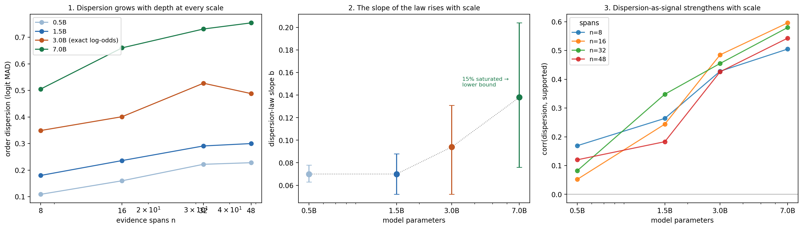

# Order sensitivity scales: the dispersion law from 0.5B to 7B

A recent ICML 2026 paper ([arXiv:2509.11208](https://arxiv.org/abs/2509.11208), Chlon et al.) shows that when a transformer verifies a claim against a set of evidence chunks, its answer probability disperses across permutations of that evidence, and the dispersion follows an empirical law: roughly a + b·log n in the number of chunks. The paper measures the law at two model sizes, Qwen2-7B and Llama-3.1-8B.

I measured how the law behaves *below* that scale: the same protocol at Qwen2.5-Instruct 0.5B, 1.5B, 3B, and 7B. Two results came out.

**The slope of the law rises with scale.** Larger models are not more order-robust on this task; they are more order-sensitive, in both absolute dispersion and in how fast dispersion grows with evidence depth.

**Dispersion becomes a stronger groundedness signal as models grow.** In my earlier [calibration study](https://github.com/Hc1012/ntkmirror-isr-calibration) of ntkmirror's ISR verifier, per-claim order-dispersion correlated positively with the gold label — supported claims wobble more. Here that correlation climbs monotonically with scale, from ~+0.10 at 0.5B to ~+0.55 at 7B.

There is also a third, accidental result about measurement itself: storing verifier outputs as probabilities at finite precision silently destroys dispersion estimates on confident models. Details below, because it faked a finding before we caught it.

## Setup

**Task and scoring.** Each item is a claim plus n evidence spans, scored by the deployed ISR verifier from [ntkmirror](https://github.com/leochlon/ntkmirror): the spans and claim are verbalized, the model scores the full choice sequences " YES" and " NO" by teacher forcing, and the two sequence log-probabilities give q = P(YES). This is the verifier as shipped, not the paper's QA framing — a deliberate choice to test whether the law transfers to the deployed artifact.

**Dataset.** Built from HotpotQA (distractor split). For each of 100 questions: the claim is "The answer to the question 'Q' is A."; supported items pair it with the gold supporting sentences plus distractor fill, insufficient items use distractor sentences only (the answer string is filtered from the fill pool). Every claim is instantiated at n ∈ {8, 16, 32, 48} spans, each span capped at 48 tokens — a within-item depth manipulation, so content is controlled across n. 800 rows per model, 50/50 balanced.

**Permutations.** m = 12 banded permutations per item (6 bands, shuffle within bands), matching the paper's scheme. Banding is degenerate at small n; n = 8 yields only 4 unique permutations and its dispersion estimates are accordingly noisier.

**Dispersion metric.** Mean absolute residual of the per-ordering score around its mean, on the logit scale (the paper's theory is stated on logits). Slopes are OLS fits of the per-n pooled mean against ln n, with bootstrap 95% CIs over items.

**Models and hardware.** Qwen2.5-Instruct 0.5B/1.5B/3B in fp16, 7B in 4-bit NF4 (as in the paper). Everything ran on a free Colab T4 plus roughly £3 of L4 pay-as-you-go.

## Result 1: the dispersion law and its slope

Dispersion grows with evidence depth at every scale, and the slope of the law rises with model size:

| model | n=8 | n=16 | n=32 | n=48 | slope b [95% CI] |
|---|---|---|---|---|---|
| 0.5B | 0.109 | 0.160 | 0.222 | 0.228 | 0.070 [0.063, 0.078] |
| 1.5B | 0.180 | 0.236 | 0.291 | 0.300 | 0.070 [0.052, 0.088] |
| 3B | 0.349 | 0.401 | 0.527 | 0.488 | 0.094 [0.052, 0.131] |
| 7B | 0.505 | 0.660 | 0.731 | 0.754 | ≥ 0.138 [0.076, 0.204] |

(logit MAD, pooled over conditions; 3B from exact log-odds, see the artifact section; the 7B value is a lower bound for the same reason.)

The absolute levels tell the same story more loudly than the slopes: at n = 48, the 7B model's answer moves about three times as much under reordering as the 0.5B model's. Scale buys verification accuracy (AUROC on this benchmark: 0.759 → 0.836 → 0.865 → 0.884) but not order-robustness. If anything the opposite.

## Result 2: dispersion-as-signal strengthens with scale

Correlation between a claim's order-dispersion and its gold label, per model and depth:

| model | n=8 | n=16 | n=32 | n=48 |
|---|---|---|---|---|
| 0.5B | +0.17 | +0.05 | +0.08 | +0.12 |
| 1.5B | +0.26 | +0.24 | +0.35 | +0.18 |
| 3B | +0.43 | +0.49 | +0.46 | +0.43 |
| 7B | +0.51 | +0.60 | +0.58 | +0.54 |

The sign is positive in all sixteen cells — supported claims disperse more, the same direction as the calibration study — and the strength climbs monotonically with scale. At 7B, order-dispersion alone is a strong groundedness feature.

A mechanism consistent with the paper's own model (its Assumption 2 writes the logit as a base term plus position-weighted content terms): a supported claim has a gold span whose position matters, so reordering moves the score; distractor-only evidence is irrelevant in every order, so the score stays flat. Under that reading, larger models weight the gold span more sharply, which would produce exactly this amplification. I have not tested the mechanism directly; it is a hypothesis that fits.

## The measurement artifact (read this if you measure dispersion)

My runner originally stored each per-ordering probability rounded to six decimals. At 3B the verifier is confident enough that 73.8% of stored values were exactly 0.0 or 1.0; identical clipped values contribute zero measured dispersion, and the 3B slope came out as 0.027 with a CI spanning zero — a spurious dip in an otherwise monotone curve.

The fix is to never store the probability at all: the two choice log-probabilities are computed anyway, and their difference lp_YES − lp_NO is the exact logit, immune to saturation at any confidence. Re-running 3B with log-odds storage raised its measured dispersion 2.2–2.5× at every depth and moved the slope to 0.094 [0.052, 0.131] — in line with its neighbours. The run is otherwise identical (AUROC matches the original to four decimals).

The 7B run retains the original storage, with 15.1% of values saturated; its dispersion and slope are therefore underestimates, which only strengthens the rising-slope conclusion. If you measure permutation dispersion on models above ~1B: store log-odds.

## Caveats

One dataset construction (HotpotQA-derived), one model family, m = 12 permutations, n ≤ 48, 100 claims per condition. The claim templating ("The answer to the question Q is A") differs in register from natural claims. The n = 8 cells rest on 4 effective permutations. My slope units (logit MAD per ln n, on this benchmark, under the ISR claim framing) are **not** directly comparable to the paper's reported b ≈ 0.377 for Qwen2-7B — different metric scale, prompt framing, and dataset suite. The planned calibration step is an anchor run of Qwen2-7B under a protocol matched as closely as possible to the paper's; until then, cross-paper comparisons are directional only. Within this study, all four models share one pipeline, so the scale trend itself does not depend on that calibration.

## Files and reproduction

The repo contains the dataset builder and runner cells, the per-model result files (full per-ordering scores), the analysis script, and the figure. Each result row carries the claim id, depth, condition, and all per-ordering values, so every number above can be recomputed from the JSONLs alone. Dataset construction is seeded and deterministic.
